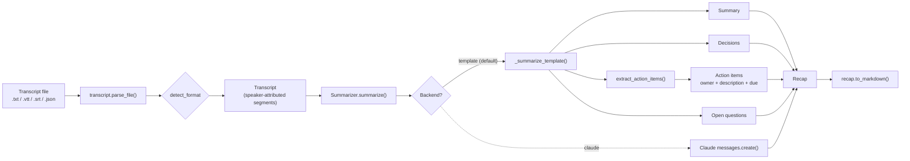
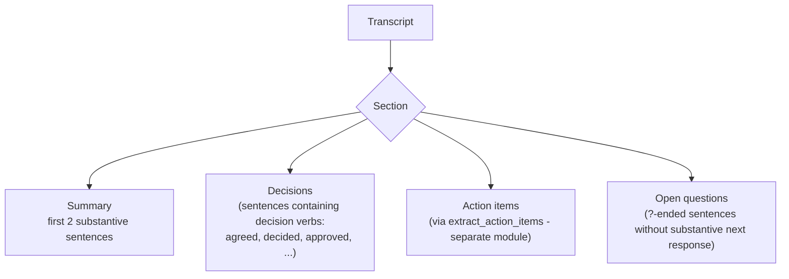
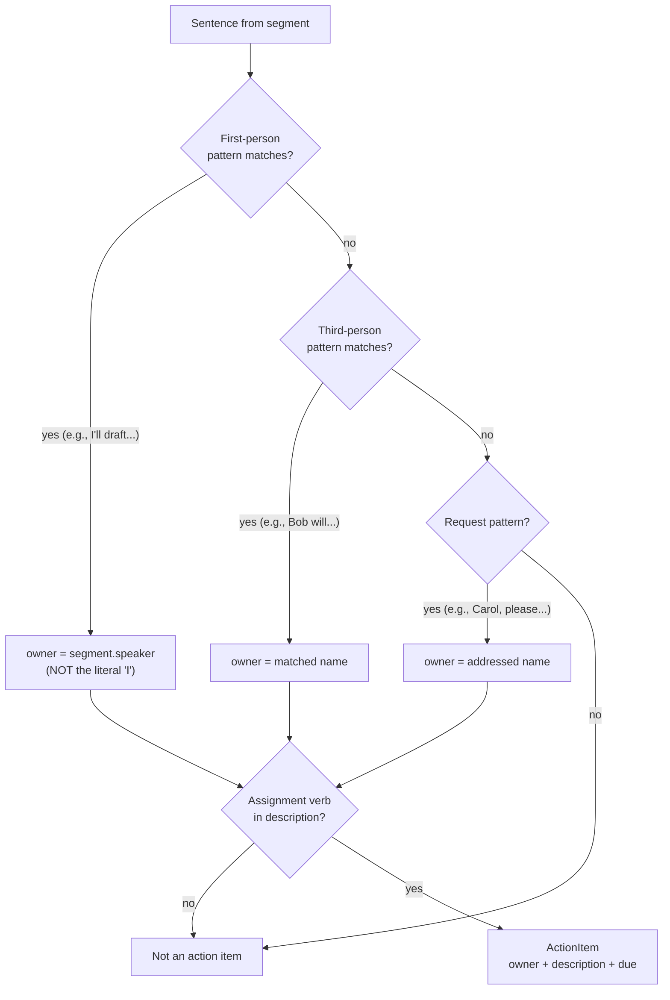
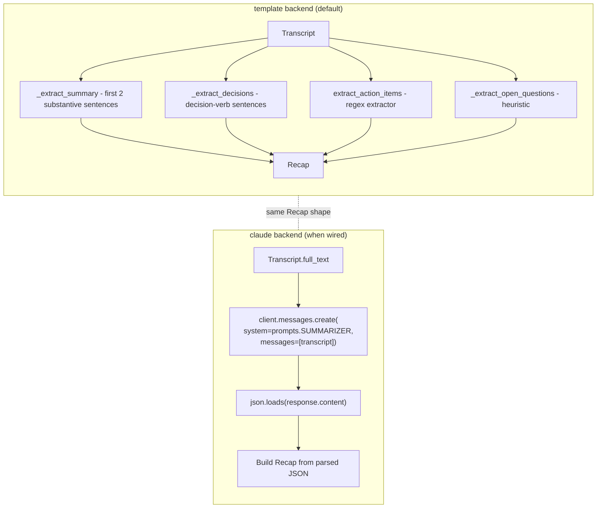
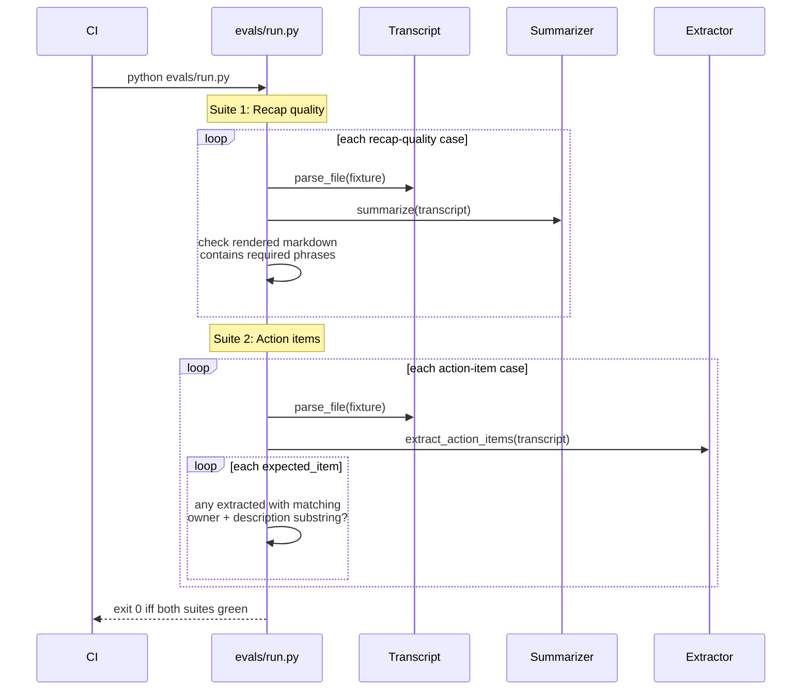

# Diagrams

GitHub renders Mermaid natively. These render on the README and here.

## End-to-end pipeline



## The 4-section recap



## Action-item extraction (the first-person trick)



## Format auto-detection

```mermaid
flowchart TB
    C[First 500 chars of content]
    C --> W{Starts with 'WEBVTT'?}
    W -- yes --> VTT[vtt]
    W -- no --> J{Starts with '{' or '['<br/>AND parses as JSON<br/>with 'segments' or 'transcript' key?}
    J -- yes --> OJ[otter_json]
    J -- no --> S{Starts with digit<br/>followed by timestamp?}
    S -- yes --> SRT[srt]
    S -- no --> TXT[text]
```

## Stub vs LLM summarizer



## Eval suite (two independent gates)



## Repo shape

```mermaid
flowchart TB
    R[meeting-summarizer-kit]
    R --> SRC[src/meeting_summarizer/]
    SRC --> S1[transcript.py — 4-format parser]
    SRC --> S2[extractor.py — action item patterns]
    SRC --> S3[summarizer.py — 4-section recap + LLM seam]
    SRC --> S4[cli.py — summarize/demo/list-formats]
    R --> FX[fixtures/]
    FX --> F1[01-product-sync.txt — plain text]
    FX --> F2[02-zoom-recording.vtt — VTT]
    FX --> F3[03-customer-call.srt — SRT]
    FX --> F4[04-otter-transcript.json — Otter JSON]
    R --> T[tests/]
    T --> T1[test_transcript.py]
    T --> T2[test_extractor.py]
    T --> T3[test_summarizer.py]
    R --> EV[evals/]
    EV --> EQ[recap-quality.json + action-items.json]
    EV --> ER[run.py — both suites]
    R --> DOCS[docs/]
    R --> CI[.github/workflows/ci.yml]
    R --> DK[Dockerfile]
```


